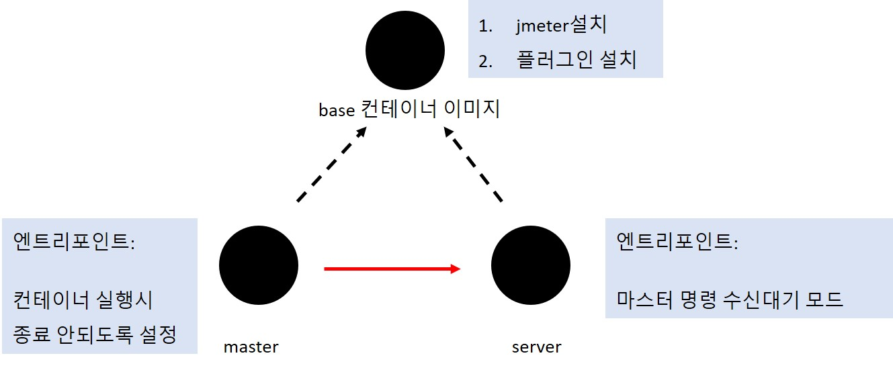

- [개요](#개요)
- [Dockerfile 빌드 순서](#dockerfile-빌드-순서)
  - [빌드순서](#빌드순서)
  - [Dockerfile 소개](#dockerfile-소개)
- [빌드 방법](#빌드-방법)
  - [base이미지](#base이미지)
  - [master이미지](#master이미지)
  - [server이미지](#server이미지)
- [컨테이너 실행](#컨테이너-실행)
  - [도커](#도커)
    - [jmeter 컨테이너 실행](#jmeter-컨테이너-실행)
    - [jmeter 명령어 실행](#jmeter-명령어-실행)
  - [쿠버네티스](#쿠버네티스)
- [참고자료](#참고자료)

<br>

# 개요
* jmeter v3.3 도커라이징(ssl 통신 비활성화)

<br>

# Dockerfile 빌드 순서
## 빌드순서
* Dockerfile -> masterDockerfile -> serverDockrefile

## Dockerfile 소개
* Dockerfile은 jmeter와 플러그인이 설치된 이미지를 빌드
* masterDockerfile은 jmeter master역할을 하는 이미지
  * 컨테이너가 실행되면 종료되지 않도록 tail -f /dev/null를 entrypoint로 실행
* serverDockerfile은 jmeter server역할을 하는 이미지
  * 컨테이너가 실행되면 server명령을 수신하기 위해 대기모드로 전환



<br>

# 빌드 방법
## base이미지
```sh
docker build -t [도커 레지스트리주소/이미지이름:base] .
```

## master이미지
```sh
docker build -t [도커 레지스트리주소/이미지이름:master] .
```

## server이미지
```sh
docker build -t [도커 레지스트리주소/이미지이름:server] .
```

<br>

# 컨테이너 실행
## 도커
### jmeter 컨테이너 실행
```
docker run -d --rm [도커 master이미지:master]
docker run -d --rm [도커 server이미지:server]
```

### jmeter 명령어 실행
```
docker cp [도커 master 프로세스] script.jmx:/jmeter/apache-jmeter-3.3/script.jmx
docker exec -it [도커 master 프로세스] jmeter -n -t /jmeter/apache-jmeter-3.3/script.jmx -Dserver.rmi.ssl.disable=true -R [server프로세스 IP]
```

## 쿠버네티스
[github Readme 문서링크](https://github.com/choisungwook/portfolio/tree/master/kubernetes/helm/jmeter)

<br>

# 참고자료
* jmeter dockerfile: https://github.com/pedrocesar-ti/distributed-jmeter-docker